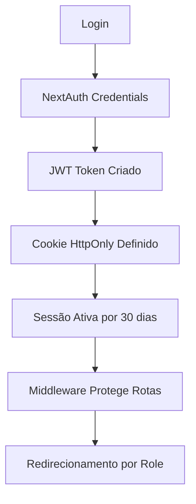

# 🔐 Sessão JWT com Cookies - ABEC Med

## ✅ Implementação Completa

### 🏗️ **Arquitetura da Sessão**



### 🔧 **Configuração NextAuth**

**Arquivo:** `src/app/api/auth/[...nextauth]/route.ts`

#### **Estratégia JWT:**

- ✅ `strategy: "jwt"`
- ✅ `maxAge: 30 dias`
- ✅ `updateAge: 24 horas`

#### **Cookies Seguros:**

```typescript
cookies: {
  sessionToken: {
    name: 'next-auth.session-token',
    options: {
      httpOnly: true,        // Segurança contra XSS
      sameSite: 'lax',       // Proteção CSRF
      path: '/',             // Disponível em todo site
      secure: production,    // HTTPS em produção
      maxAge: 30 * 24 * 60 * 60 // 30 dias
    }
  }
}
```

#### **Callbacks JWT:**

- `jwt()` - Adiciona dados do usuário ao token
- `session()` - Mapeia token para sessão do cliente
- `redirect()` - Controla redirecionamentos pós-login

### 🛡️ **Proteção de Rotas**

**Arquivo:** `src/middleware.ts`

#### **Middleware com withAuth:**

```typescript
export default withAuth(
  function middleware(req) {
    // Verificação de roles por rota
    // Redirecionamento automático
  },
  {
    callbacks: {
      authorized: ({ token }) => !!token,
    },
  }
);
```

#### **Rotas Protegidas:**

- `/admin/*` → Apenas `admin`
- `/medic/*` → `admin`, `medico`, `doctor`
- `/acolhimento/*` → `admin`, `reception`, `recepcao`
- `/paciente/*` → Todos os roles autenticados

### 🎯 **Fluxo de Autenticação**

1. **Login** → Credenciais verificadas
2. **JWT Criado** → Token com dados do usuário
3. **Cookie Definido** → HttpOnly, 30 dias
4. **Middleware** → Protege rotas automaticamente
5. **Redirecionamento** → Baseado no role do usuário

### 🔄 **Redirecionamento por Role**

```typescript
const roleRedirects = {
  admin: "/admin/dashboard",
  medico: "/medic",
  doctor: "/medic",
  reception: "/acolhimento/agendamentos",
  recepcao: "/acolhimento/agendamentos",
  paciente: "/paciente/dashboard",
  patient: "/paciente/dashboard",
};
```

### 🎛️ **Hooks Personalizados**

**Arquivo:** `src/hooks/useAuthSession.ts`

#### **useAuthSession:**

```typescript
const { user, isLoading, isAuthenticated, logout, redirectToRole } =
  useAuthSession();
```

#### **useAuthorization:**

```typescript
const { canAccessAdmin, canAccessMedic, canAccessReception } =
  useAuthorization();
```

### 💾 **Persistência da Sessão**

- ✅ **Cookie httpOnly** - Não acessível via JavaScript
- ✅ **30 dias de duração** - Renovado automaticamente
- ✅ **Atualização a cada 24h** - Mantém sessão ativa
- ✅ **Seguro em produção** - HTTPS obrigatório

### 🔍 **Verificação de Sessão**

#### **Cliente (React):**

```typescript
import { useSession } from "next-auth/react";

const { data: session, status } = useSession();
// status: "loading" | "authenticated" | "unauthenticated"
```

#### **Servidor (API):**

```typescript
import { getServerSession } from "next-auth";
import { authOptions } from "@/app/api/auth/[...nextauth]/route";

const session = await getServerSession(authOptions);
```

### 🚨 **Tratamento de Erros**

- ✅ **Página /unauthorized** para acessos negados
- ✅ **Redirecionamento automático** para login
- ✅ **Logs detalhados** em desenvolvimento
- ✅ **Fallback gracioso** em caso de erro

### 🛠️ **Utilitários Disponíveis**

```typescript
import { roleUtils } from "@/hooks/useAuthSession";

roleUtils.isAdmin(role);
roleUtils.isMedic(role);
roleUtils.getRoleDisplayName(role);
```

### 🧪 **Como Testar**

1. **Login** com `admin@abecmed.com / admin123`
2. **Verificar cookie** nas DevTools → Application → Cookies
3. **Navegar entre rotas** protegidas
4. **Verificar redirecionamento** automático
5. **Testar logout** e limpeza da sessão

### 📱 **Status da Implementação**

- ✅ **JWT com cookies** funcionando
- ✅ **Proteção de rotas** ativa
- ✅ **Redirecionamento por role** implementado
- ✅ **Middleware de segurança** configurado
- ✅ **Hooks personalizados** disponíveis
- ✅ **Persistência de 30 dias** ativa
- ✅ **Renovação automática** configurada

### 🔐 **Segurança Implementada**

- 🛡️ **HttpOnly cookies** - Previne XSS
- 🛡️ **SameSite=lax** - Previne CSRF
- 🛡️ **Secure em produção** - Apenas HTTPS
- 🛡️ **Role-based access** - Controle granular
- 🛡️ **Token expiration** - Sessões limitadas
- 🛡️ **Middleware protection** - Verificação automática

**🎉 A sessão JWT com cookies está totalmente funcional e segura!**
